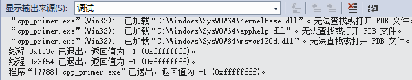
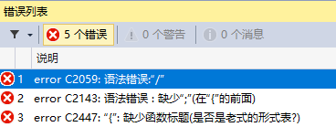
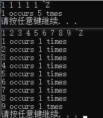
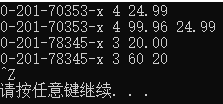
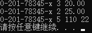
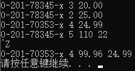
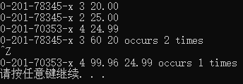

## 练习 1.1

> 查阅你使用的编辑器的温度，确定它使用的文件命名约定。编译并运行第二页的main函数
* [GCC and File Extensions - Development with GNU/Linux](http://labor-liber.org/en/gnu-linux/development/index.php?diapo=extensions)
* [为 Visual C++ 项目创建的文件类型](https://msdn.microsoft.com/zh-cn/library/3awe4781(v=vs.120).aspx)


## 练习 1.2

> 改写程序，让它返回-1。返回值-1通常被都能做程序错误的标识。重新编译并运行你的程序，观察你的系统如何处理main返回的错误标识。

从打印信息上看，没有区别。调试信息如下：




## 练习 1.3

> 编写程序，在标准输出上打印Hello, World。

```c++
#include <iostream>

int main ()
{
    std::cout << "Hello World" << std::endl;
    return 0;
}
```


## 练习 1.4 

> 我们的程序使用假发运算符”+“来将两个树相加。编写程序使用乘法运算符”*“，来打印两数相加

```C++
#include <iostream>

int main ()
{
    std::cout << "Input two number:" << std::endl;
    int v1 = 0, v2 = 0;
    std::cin >> v1 >> v2;
    std::cout << "The Product is " << v1 * v2 << std::endl;
}
```


## 练习 1.5

> 我们将所有输出操作放子啊一条很长的语句中。重写程序，将每个对对象的答应操作放在一个独立的语句中

```C++
#include <iostream>

int main ()
{
    std::cout << "Input two number:" << std::endl;
    int v1 = 0, v2 = 0;
    std::cin >> v1 >> v2;
    std::cout << "The Product is ";
    std::cout << v1 * v2;
    std::cout << std::endl;
}
```


## 练习 1.6

> 解释下面程序片段是否合法。
>
> ```C++
> std::cout << "The sum of " << v1;
>           << " and " << v2;
>           << " is " << v1 + v2 << std::endl;
> ```
>
> 如果程序是合法的，它输出什么？如果程序不合法，原因何在？应该如何修正？

不合法。
错误信息输出：**错误	1	error C2143: 语法错误 : 缺少“;”(在“<<”的前面)**
修正：删除头两行后面的分号

```C++
std::cout << "The sum of " << v1
          << " and " << v2
          << " is " << v1 + v2 << std::endl;
```


## 练习1.7

> 编译一个包含不正确的嵌套注释的程序，观察编译器返回的错误信息

```C++
#include <iostream>
/*
*   注释在这里嵌套
*	/* 这里的嵌套是错的 */
*
* /

int main()
{
    return 0;
}
```

错误信息：



## 练习1.8

> 指出下列哪些输出语句是合法的（如果有的话）：
>
> ```C++
> std::cout << "/*";
> std::cout << "*/";
> std::cout << /* "*/" */;
> std::cout << /* "*/" /* "/*" */; 
> ```
>
> 预编译这些语句会产生什么样的结果，实际编译这些语句来验证你的答案（i安歇一个小程序，每次将上是语句作为其主题），改正每个编译错误。

第三行编译出错，改正方法是增加一个引号。

```C++
std::cout << /* "*/" */";
```

输出：

```C++
/**/ */ /*
```


## 练习 1.9

> 编写程序，使用while循环将50到100的整数相加。

```C++
#include <iostream>

int main()
{
    int sum = 0, count = 50;
    while (count <= 100)
    {
        sum += count;
        count++;
    }
    std::cout << sum << std::endl;
}
```


## 练习 1.10

> 除了++运算符将运算对象的值怎加1之外，还由一个递减运算符”--“实现将值减少1.编写程序，使用递减运算符子循环中安递减顺序打印出10到0之间的整数。

```C++
#include <iostream>

int main()
{
    int count = 10;
    while (count >= 0)
    {
        std::cout << count << std::endl;
        count--;
    }
}
```


## 练习 1.11

> 编写程序，提示用户输入两个整数，打印出这两个整数所指定的范围内的所有整数。

```C++
#include <iostream>

int main()
{
    int count = 10;
    int hi = 0, lo = 0, temp = 0;
    std::cout << "Input low number:" << std::endl;
    std::cin >> lo;
    std::cout << "Input high number:" << std::endl;
    std::cin >> hi;

    while (lo <= hi)
    {
        std::cout << lo << std::endl;
        lo++;
    }
}
```


## 练习 1.12

> 下面的for循环完成了什么功能？sum的终值是多少？

```C++
int sum = 0;
for (int i = -100; i <= 100; ++i)
    sum +=i;
```

从 -100 加到 100 ，sum 的终值为 0。


## 练习 1.13

> 使用for循环重做练习1.9到1.10中的所有练习

```C++
#include <iostream>

int main()
{
    std::cout << "Exercise 1.9" << std::endl;
    int sum1_9 = 0;
    for (int i = 50; i <= 100; ++i) sum1_9 += i;
    std::cout << "the sum is: " << sum1_9 << std::endl;

    std::cout << "Exercise 1.10" << std::endl;
    for (int cnt = 10; cnt >= 0; cnt--)
        std::cout << cnt << std::endl;

    std::cout << "Exercise 1.11" << std::endl;
    std::cout << "Input two number:" << std::endl;
    int low = 0, high = 0;
    std::cin >> low >> high;
    if (low > high)
    {
        int temp = high;
        high = low;
        low = temp;
    }
    for (; low <= high; low++)
        std::cout << low << std::endl;
}
```


## 练习 1.14

> 对比for循环和while循环，两种形式的优缺点是什么？

[在Stack Overflow上面有与这个相似的问题](http://stackoverflow.com/questions/2950931/for-vs-while-in-c-programming)


## 练习 1.15

> 编写程序，包含第14页“再探编译”中讨论的常见错误。熟悉编译器生成的错误信息。

常见的错误有语法错误、类型错误、声明错误，这些都是编译器可以检查出的错误。


## 练习1.16

> 编写程序，从cin读取一组数，输出其和。

```C++
#include <iostream>

int main()
{
    int sum = 0, value = 0;
    //input Ctrl+Z to stop input number at Windows
    //input Ctrl+D to stop input numver at Unix
    while (std::cin >> value)
    {
        sum += value;
    }
    std::cout << sum << std::endl;
    return 0;
}
```


## 练习 1.17

> 如果输入的所有值都是相等的，程序会输出什么？如果没有重复值，输出又会是怎样的？
>
> ```C++
> #include <iostream>
> int main()
> {
>     int currVal = 0, val = 0;
>     if (std::cin >> currVal)
>     {
>         int cnt = 1;
>         while (std::cin >> val)
>         {
>             if (val == currVal)
>             {
>                 ++cnt;
>             }
>             else
>             {
>                 std::cout << currVal << " occurs "
>                           << cnt << " times " << std::endl;
>                 currVal = val;
>                 cnt = 1;
>             }
>         }
>         std::cout << currVal << " occurs "
>                   << cnt << " tmes " << std::endl;
>     }
> }
> ```

相同，则执行一次std::cout；不相同，则输出多次std::cout


## 练习 1.18

> 编译并运行练习1.18的程序，给它输入全都相等的值。再次运行程序，输入没有重复的值。




## 练习 1.19

> 修改练习1.11的程序，使其额能处理用户输入的第一个数比第二个数小的情况。

```C++
#include <iostream>

int main()
{
    int count = 10;
    std::cout << "Input two number:" << std::endl;
    int hi = 0, lo = 0, temp = 0;
    std::cin >> lo >> hi;

    if (lo > hi)
    {
        temp = hi;
        hi = lo;
        lo = temp;
    }

    while (lo <= hi)
    {
        std::cout << lo << std::endl;
        lo++;
    }
}
```


## 练习 1.20

> 在网站http://www.informit.com/title/032174113 上，第1章的代码目录包含了头文件 Sales_item.h。将它拷贝到你自己的工作目录中。用它编写一个程序，读取一组书籍销售记录，将每条记录打印到标准输出上。

将Sales_item.h和Version_test.h文件放到工程项目中

```C++
#include <iostream>
#include "Sales_item.h"

int main()
{
    for (Sales_item item; std::cin >> item; std::cout << item << std::endl);
    return 0;
}
```

运行结果：




## 练习 1.21

> 编写程序，读取两个 ISBN 相同的 Sales_item 对象，输出他们的和。

```C++
#include <iostream>
#include "Sales_item.h"
int main()
{
    Sales_item item1, item2;
    std::cin >> item1 >> item2;

    if (item1.isbn() == item2.isbn())
    {
        std::cout << item1 + item2 << std::endl;
    }
    else
    {
        std::cerr << "Different ISBN." << std::endl;
    }

    return 0;
}
```

运行结果：




## 练习 1.22

> 编写程序，读取多个具有相同 ISBN 的销售记录，输出所有记录的和。

```C++
#include <iostream>
#include "Sales_item.h"
int main()
{
    Sales_item total;
    if (std::cin >> total)
    {
        Sales_item trans;
        while (std::cin >> trans)
        {
            if (total.isbn() == trans.isbn())
                total += trans;
            else
            {
                std::cout << total << std::endl;
                total = trans;
            }
        }
        std::cout << total << std::endl;
    }
    else
    {
        std::cerr << "No data?!" << std::endl;
        return -1;
    }

    return 0;
}
```

运行结果：




## 练习 1.23

> 编写程序，读取多条销售记录，并统计每个 ISBN（每本书）有几条销售记录。

```C++
#include <iostream>
#include "Sales_item.h"

int main()
{
    Sales_item currItem, valItem;
    if (std::cin >> currItem)
    {
        int cnt = 1;
        while (std::cin >> valItem)
        {
            if (valItem.isbn() == currItem.isbn())
            {
                ++cnt;
            }
            else
            {
                std::cout << currItem << " occurs " << cnt << " times " << std::endl;
                currItem = valItem;
                cnt = 1;
            }
        }
        std::cout << currItem << " occurs " << cnt << " times " << std::endl;
    }
    return 0;
}
```


## 练习 1.24

> 输入表示多个 ISBN 的多条销售记录来测试上一个程序，每个 ISBN 的记录应该聚在一起。

运行结果：

