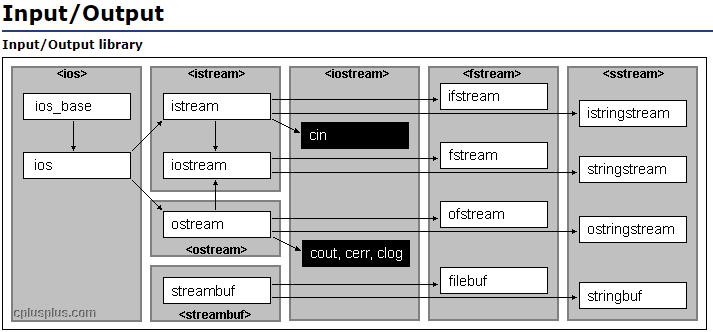

# 开始

C++的大部分基础内容包括：

1. 类型
2. 变量
3. 表达式
4. 语句
5. 函数


## 1.1 编写一个简单的C++程序

1. 每个C++程序包含 **一个或多个** 函数（function）
2. C++程序必须包含一个命名未**main**的函数
   - 函数包括：
     - 返回类型（return type）
     - 函数名（function name）
     - 一个括号包围的形参列表（parameter list），可以为空
     - 函数体（function body）：以左花括号（curly brace）开始，以右花括号结束的语句块（block of staements）
   - main函数
     - 形参可以为空，[main函数的其他形参类型](www.baidu.com)
     - 返回类型必须是[内置类型(buil-in type)](www.baidu.com) **int**
     - main返回0表示成功，非0数值由系统定义
```c++
int main()
{
	return 0;
}
```
3. C++源文件（source file）见后缀：.cc、.cxx、.cpp、.cp、.C
4. 编译器程序：CC，gcc（GNU编译器），c1（Visual Studio 2010）
5. 默认可执行程序：文件名.exe（Windows）、a.out（类Unix）
6. 获取执行结果返回值：

```shell
# UNIX系统
$ echo $?
# Windows系统
$ echo %ERRORLEVEL%
```


## 1.2 初识输入输出

1. 标准库（standard library）来提供IO机制
   * [iostream库](http://www.cplusplus.com/reference/iolibrary/)包含两个基础类型istream和ostream，分别表示输入流和输出流
   
   * 流（stream）：随时间的推移，字符是顺序生成或消耗的。

2. 标准输入输出对象
   * 标准输入对象：cin
   * 标准输出对象：cout
   * 标准错误对象：cerr
   * 标准信息对象：clog

3. 通过#includ指令包含iostream库
```c++
#include <iostream>
```

4. 向流写入数据的表达式
    * 表达式：产生计算结果，由一个或多个运算对象和一个运算组成
    * <<：输出运算符，左值必须为ostrem对象，运算返回ostream对象
    * std：命名空间
    * "::"：作用域运算符
    * cout：ostream对象
    * "Enter two numbers:"：字符串字面值常量（string literal）
    * endl：操纵符（manipulator）
    * ”>>“：输入运算符，左侧必须为istrem对象，运算返回istream对象

```c++
std::cout << "Enter two numbers:" << std::endl;
int v1 =0, v2 = 0;
std::cin >> v1 >> v2;
std::cout << "The sum of " << v1 << " and " << v2 << " is " << v1 + v2 << std::endl;
```


## 1.3 注释简介

* 单行注释：双斜线（//）开始，到行末结束
* 界定符注释
  * 符号：/* 符号开始， */符号结束
  * 可用于多行注释，建议多行时行首用星号开始
  * 界定符注释不能嵌套


## 1.4 控制流

* while语句：先判断condition；当条件符合则执行statement；statement可以是语句块

  ```C++
  while (condition)
      statement
  ```

* for语句

  * 包含循环头和循环体
  * 第一次进入执行init-statement；init-statement可以包含多条表达式，表达式之间用逗号分隔；
  * 然后判断condition；若条件符合则执行循环体；循环体结束后执行expression；
  * expression执行结束，进入condition判断；重复之前的操作

  ```C++
  for (init-statement; condition; expression)
      loop body;
  ```

* 读取数量不定的输入数据：循环读取输入到value；直到执行Ctrl+Z（Windows）或Ctrl+D（Unix0）退出循环

  ```C++
  while (std::in >> value)
  ```

* if语句：条件为真则执行对应语句

  ```C++
  if (condition1)  		//必须有
      statement 1;
  else if (condition 2) 	//可有可无
      statement 2;
  else					//可有可无
      statement;
  ```

  

## 1.5 类简介

* 类（class）用来定义自己的数据结构
* 类类型（class type）：类定义一个类型以及与其关联的一组操作
* 类的成员函数（member function）：定义为类的一部分函数，又是也称为方法（method）
* 使用点运算符（.）表达使用对象的成员
* 文件重定向：programe < inputfile > outputfile


